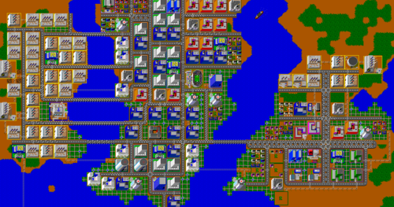
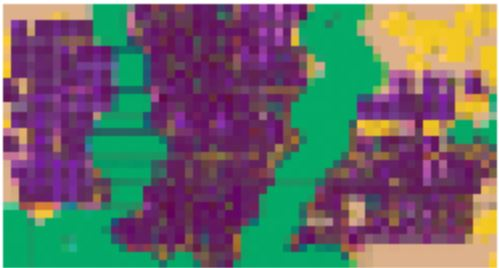

# Pixel2Vec

A self-supervised feature extraction trained on the single image.

An example use in a preprint:

* Piotr Migdał, Bartłomiej Olechno, Błażej Podgórski, [Level generation and style enhancement - deep learning for game development overview](https://arxiv.org/abs/2107.07397), arXiv:2107.07397.

## Installation

The preferred way to install is to use a [conda environment](https://conda.io/projects/conda/en/latest/user-guide/tasks/manage-environments.html).

```{bash}
git clone git@github.com:Bartolo1024/Pixel2Vec.git
cd Pixel2Vec
conda env create -f .\environment.yml
conda activate pixel2vec
```

## Run

To train the SOTA model on the minesweeper image run command:\
```{bash}
python train.py --experiment-file experiments/minesweeper.yaml```

Note: on Windows 10 you want to set in `experiments/[name].yaml` file `num_workers: 0`, otherwise it will be super slow, vide https://github.com/pytorch/pytorch/issues/12831.

## Data

Example inputs are placed in subfolders in the `data` directory.
Each data has its own directory, e.g. `data/minesweeper`, which contains one or more files.

## Example results

The model was trained on the given Simcity image. All feature vectors were projected into 3d space, and presented as the RGB image. The result is shown on the bottom.  




## Funding

This project is supported by the EU R&D grant POIR.01.02.00-00-0052/19 for project [GearShift – building the engine of the behavior of wheeled motor vehicles
and map generation based on artificial intelligence algorithms implemented on the Unreal Engine platform – GAMEINN](https://mapadotacji.gov.pl/projekty/874596/?lang=en).

